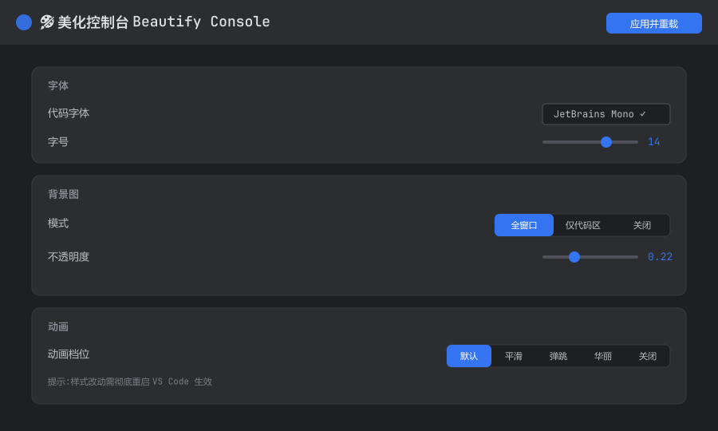

# 🎨 美化控制台 Beautify Console

一个 VS Code 一站式可视化美化面板。字体、布局、编辑器、动画、多区域背景图、圆角、主题——全部在一个图形面板里点选调节，无需手写 JSON。

> A visual, one-stop beautify panel for VS Code. Tune fonts, layout, editor, animations, multi-region background images, corner radius and themes — all from one GUI, no JSON editing.



## ✨ 功能 Features

- **字体**：可视化选择已安装的编程字体（自动检测 ✓）、字号、行高、字重、连字
- **布局**：状态栏、面包屑、活动栏位置、菜单栏、标签页缩放
- **编辑器**：光标平滑、平滑滚动、括号染色、缩进线、粘性滚动、缩略图、内边距
- **动画**：5 档（默认/平滑/弹跳/华丽/关闭），基于经过验证的 spring 缓动曲线
- **背景图**：四种模式 —— 全窗口 / 仅代码区 / 多区域 / 关闭
- **多区域背景**：编辑器、侧栏、面板各自独立设图与不透明度，深色主题下用 `mix-blend-mode: screen` 自然融合（可关）
- **多图轮播**：某个区域放多张图即自动轮播，淡入淡出过渡，每张停留时长可调；遵循系统的「减少动效」设置
- **自定义 CSS**：独立的 `cus-custom.css`，本插件永不覆盖；写坏界面有一键逃生快捷键
- **圆角**：一个滑块统一控制所有 UI 圆角
- **配置导入导出**：整套美化配置存成一个 JSON，可分享；导入时逐项校验
- **每个参数带问号**：悬停显示白话解释，专业术语讲人话

## 📦 依赖 Dependency

本扩展通过 [Custom UI Style](https://marketplace.visualstudio.com/items?itemName=subframe7536.custom-ui-style) 注入样式，安装时会自动提示安装它。本扩展还依赖两个 JetBrains 主题扩展（Int UI Dark 深色主题与 int-ui-icons-dark 图标主题），安装时会自动安装。

## 🚀 安装 Install

### 方式一：安装 .vsix（推荐）
1. 从 [Releases](https://github.com/dwgx/beautify-console/releases) 下载最新 `.vsix`
2. VS Code 里 `Ctrl+Shift+P` → `Extensions: Install from VSIX...` → 选中该文件
3. 首次会提示安装依赖 Custom UI Style，同意即可
4. `Ctrl+Shift+P` → `美化: 打开控制台`

### 方式二：源码安装
```bash
git clone https://github.com/dwgx/beautify-console
cd beautify-console

# macOS / Linux
bash install.sh

# Windows
powershell -ExecutionPolicy Bypass -File install.ps1
```

装完需要**完全退出** VS Code 再启动（macOS 是 `Command + Q`，不是关窗口；Windows 需结束所有 `Code.exe`）。`Reload Window` 不会刷新 Custom UI Style 的 external.css 缓存。

### 🍎 macOS 补充说明

- macOS 默认不把 `code` 命令加进 PATH，`install.sh` 会自动回退到 app bundle 里自带的二进制，无需手动配置
- 样式注入需要写入 `/Applications/Visual Studio Code.app`。若注入时报 `Maximum call stack size exceeded`，先完全退出 VS Code 再执行：
  ```bash
  sudo chown -R $(whoami) "/Applications/Visual Studio Code.app"
  ```
- 「菜单栏」一项在 macOS 上不显示——菜单由系统顶栏接管，`window.menuBarVisibility` 无效
- 若你在 Windows 上用过本扩展并开了 Settings Sync：同步过来的 `custom-ui-style.external.imports` 里会残留 Windows 路径（`file://C:/Users/...`），这些条目在 macOS 上解析不到文件。**v1.0.5 起会在激活时自动清理**，你自己手加的 import 不受影响

## 🖱 使用 Usage

- `Ctrl+Shift+P` → **美化: 打开控制台** 打开图形面板
- 原生参数（字体/布局/编辑器/主题）**改完即时生效**
- 背景/动画/圆角类改动会累积一个 **⚡ 待重启** 提示，点「立即重启」统一生效
- 每个参数右侧的 **?** 悬停查看白话解释

### 多区域背景与轮播

背景模式选**多区域**后会出现「多区域背景」区块，编辑器 / 侧栏 / 面板各一行：

- **添加图片…** 可一次选多张。图片会复制到用户目录下的 `backgrounds/`，原图移动或删除都不影响
- 某个区域有 **2 张以上**图片时，自动变成轮播，并多出一行「↳ 每张停留」控制间隔
- 每个区域的不透明度独立调节
- **混合模式**开关：深色主题下 `mix-blend-mode: screen` 让图与底色融合；浅色主题会发白，关掉即可
- **图片引用方式**默认「直接引用」：CSS 里只写路径，体积极小。若图片不显示，切到「内嵌 base64」——
  能用但 CSS 会大几十倍（12 张 2MB 的图内嵌约 33MB，直接引用约 1KB）。
  内嵌模式下超过 2MB 的单图会自动退回直接引用并提示 —— 否则光三个区域各 4 张就能产出 112MB CSS，
  而这个文件每次开窗都要被解析。扩展名必须在白名单内（.png/.jpg/.jpeg/.webp/.gif/.bmp/.svg），
  否则即使小于 2MB 也无法内嵌，会直接跳过该图
- 同名不同图不会互相覆盖（自动补序号），重复选同一张图会复用而不堆积

轮播是纯 CSS 实现，不依赖后台定时器。系统开启「减少动效」时会停在第一张不闪。

### 自定义 CSS

面板里点「打开 cus-custom.css」会在编辑器中打开该文件。本插件只负责创建它，**永不覆盖**你写的内容
（生成的样式在 `cus-dynamic.css`，两个文件分开就是为了这个）。它在注入顺序上排最后，所以同优先级下
你的规则会压过本插件生成的规则。

> ⚠️ **先看这条再动手**：自定义 CSS 能把整个界面弄成不可见，连命令面板也会一起藏掉。
> 此时按 **`Cmd/Ctrl` + `Alt` + `Shift` + `F12`** 一键关闭自定义 CSS 即可恢复 ——
> CSS 只能破坏渲染、破坏不了 JS，键绑定不依赖界面可见，所以界面全黑时它依然有效。
> 文件内容会保留，不会丢。
>
> 注意 `code --disable-extensions` **救不了** —— Custom UI Style 的补丁是写进 VS Code 自身文件的，
> 禁用扩展不会还原已落盘的改动。彻底的兜底见下方「恢复手段」。

改完自定义 CSS 需要点「应用并重载」才生效（没有文件监听）。**三个平台上这一步都会完全退出并重新打开
VS Code**，不是刷新窗口 —— 先存好手头的文件。

### 配置导入导出

导出会把三处配置收进一个 JSON：VS Code 设置项、`cus-base.css` 里的圆角变量、以及状态文件。
图片**按路径引用而非内嵌** —— 内嵌会让文件大到无法分享，也没法手改。

导入时所有值都会校验：设置项按声明的类型检查，非法值、未知键、越界数字一律丢弃并告诉你丢了什么；
本机不存在的图片路径会被跳过并列出（从 Windows 导出的配置在 macOS / Linux 上就属于这种情况）。

你现有的 `cus-custom.css` 会先备份成带时间戳的 `.bak`，通知里会点明备份文件名 —— 连续导入不会把原文冲掉。
内容与现有一致时不产生多余备份。

## ⚠️ 说明 Notes

- 支持 Windows / macOS / Linux。用户目录、字体扫描目录、`file://` URL 均按平台解析
- 本扩展通过修改 VS Code 核心文件注入样式（经由 Custom UI Style），这是非官方手段：
  - 启动时可能出现「安装似乎已损坏」黄条，点齿轮「不再显示」即可
  - **VS Code 更新后**样式可能失效 → 重新运行 `Custom UI Style: Reload`
- 背景图会自动复制到用户目录，不怕原图移动丢失
- 样式改动生效需**完全退出** VS Code（macOS 是 `Command + Q`）。`Reload Window` 不重建 external.css 缓存
- 图片默认按 `vscode-file://vscode-app` 引用。依据是 workbench 自身就从该 origin 加载（故 CSP 的
  `img-src 'self'` 覆盖它），且 Electron 的协议校验为「路径在白名单目录下**或**扩展名在白名单内」。
  这两点是读 Electron 与 Custom UI Style 源码得出的，**未在运行中的 VS Code 里逐一实测**。
  若背景不显示，把「图片引用方式」切到「内嵌 base64」即可 —— 那条路径是原先验证过的方式

## 🆘 恢复手段 Recovery

界面被自定义 CSS 弄坏时，按顺序试：

1. **`Cmd/Ctrl` + `Alt` + `Shift` + `F12`** —— 一键关闭自定义 CSS。界面全黑也有效
2. 命令面板 → `Custom UI Style: Rollback` —— 还原 VS Code 文件，本插件的样式也一起没了，但保证干净
3. **界面完全不可用时，用终端**。需要清两个文件：我们的源文件，以及 CUS 已生成的产物
   （只清源文件的话，旧的 external.css 会一直留着直到下次 CUS 重载）

```bash
# macOS
: > "$HOME/Library/Application Support/Code/User/cus-custom.css"
# 两个目录名都试:不同 VS Code 版本 workbench 落在 electron-browser 或 electron-sandbox
for d in electron-browser electron-sandbox; do
    f="/Applications/Visual Studio Code.app/Contents/Resources/app/out/vs/code/$d/workbench/external.css"
    [ -f "$f" ] && : > "$f"
done
# 然后 Command+Q 完全退出再打开
```

Linux 同理，路径为 `/usr/share/code/resources/app/out/vs/code/<electron-browser|electron-sandbox>/workbench/external.css` 与 `~/.config/Code/User/`；
Windows 为 `%LOCALAPPDATA%\Programs\Microsoft VS Code\resources\app\out\…` 与 `%APPDATA%\Code\User\`。
（macOS 路径已实机核对，另两个平台按同样结构推得。两个目录名都清一遍是兜底 —— 界面全黑时不该再赌版本。）

## 🧪 开发 Development

```bash
npm test    # 跨平台路径 / 字体 / CSS 生成 / 状态校验 用例（node --test，无第三方依赖）
```

## 🙏 致谢 Credits

- 背景注入选择器方案参考 [shalldie/vscode-background](https://github.com/shalldie/vscode-background)（MIT）
- 样式注入依赖 [subframe7536/vscode-custom-ui-style](https://github.com/subframe7536/vscode-custom-ui-style)（MIT）

## 📄 License

MIT

